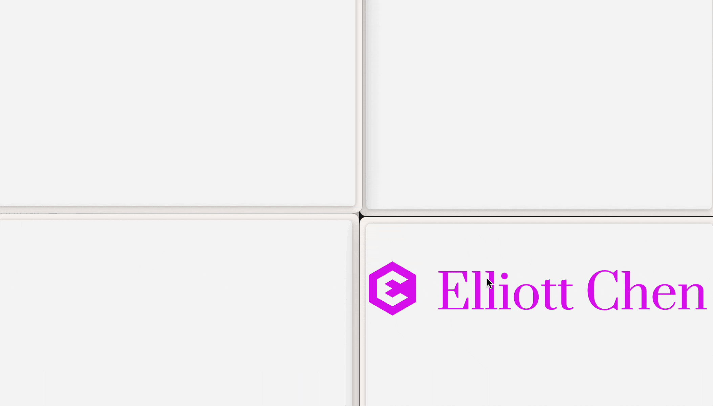

# Introduction

> [!IMPORTANT]
> I asked Google Bard (Gemini) to generate the follow doc for me, not bad.

# Interactive Card Movement

This is an interactive card that you can drag and move around the screen. It utilizes the BroadcastChannel API to communicate between windows and synchronize the card position across multiple devices.

## Functionality

- Drag the card by clicking and holding it, then moving the mouse.
- The card's position is updated in real-time across all devices connected to the same BroadcastChannel.
- Specify the card's image using a URL parameter named `type`.

## How it works

The code defines several functions to handle card movement:

- `barHeight`: Calculates the height of the browser's address bar.
- `clientToScreen`: Converts client coordinates (relative to the viewport) to screen coordinates (absolute on the monitor).
- `screenToClient`: Converts screen coordinates to client coordinates.
- `moveCard`: Handles the mousedown event on the card and starts the drag interaction.
- `handleMouseMove`: Updates the card's position based on mouse movement.
- `handleMouseUp`: Removes event listeners when the mouse is released.
- `init`: Initializes the card with the specified image type from the URL parameter.

The code also utilizes the BroadcastChannel API to communicate between windows:

- A channel named "card" is created.
- When the card is dragged, its screen coordinates are sent to the channel.
- Any other window connected to the same channel will receive the message and update the card's position accordingly.

## Requirements

This code requires a modern web browser that supports the BroadcastChannel API. It assumes the existence of SVG files named Q.svg and A.svg in the same directory as the code.

## Usage

1. Open the code in a web browser.
2. Click and hold the card to start dragging it.
3. Move the mouse to drag the card to a new position.
4. The card's position will be updated in real-time across all devices connected to the same BroadcastChannel.
5. You can change the card's image by adding a URL parameter named `type` to the URL. For example, `https://example.com/?type=A` will display the card with the image named A.svg.
